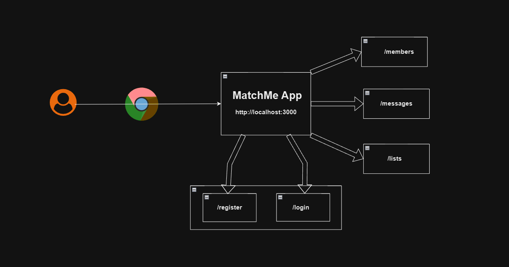
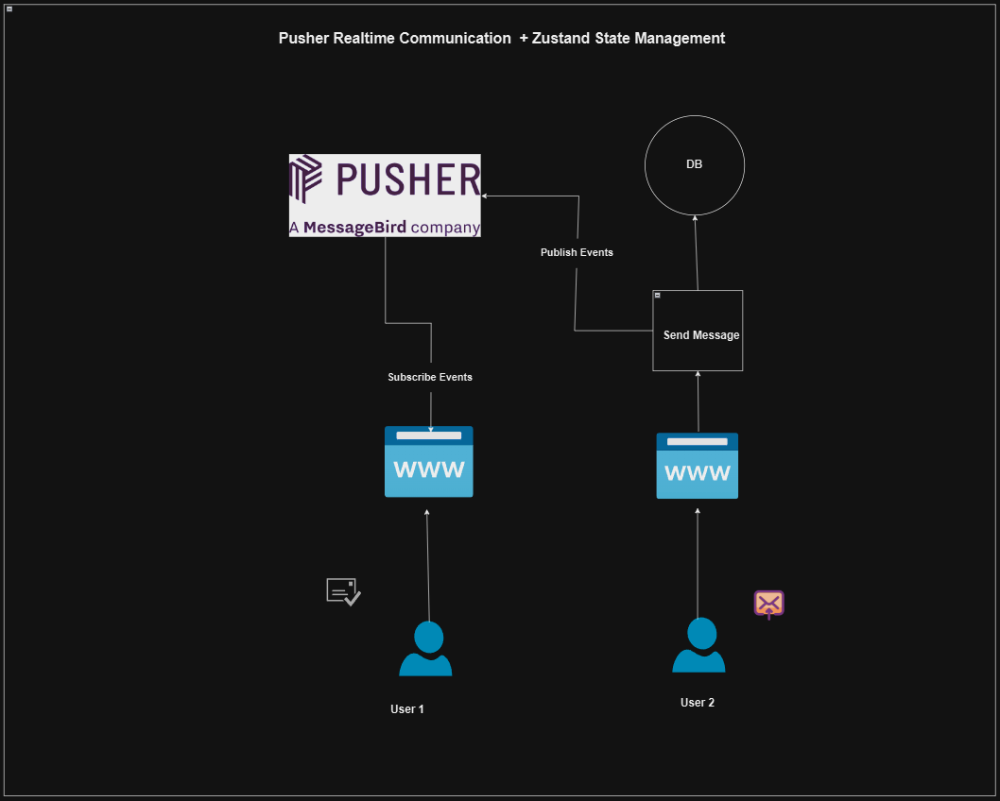

# MatchMe - Dating App

A dating app where users can create profiles, match with others, and chat. This project is built using Next.js and integrates various features to create a seamless experience for users.

## Project Info

- **Name**: MatchMe
- **Description**: A dating app for connecting people.
- **Tech Stack**:
  - **Next.js**: React framework for building fast web apps.
  - **Prisma ORM**: Object-Relational Mapping for database interaction.
  - **TailwindCSS**: Utility-first CSS framework for custom designs.
  - **NextUI**: Component library for modern, responsive UI components.
  - **NextAuth**: Authentication for Next.js applications.
  - **TypeScript**: A superset of JavaScript for static typing.
  - **React**: JavaScript library for building user interfaces.

## Scripts

Here are the `npm` scripts for building and running the app:

- **`npm run dev`**: Starts the Next.js development server.
- **`npm run build`**: Builds the app for production.
- **`npm run start`**: Starts the production server.
- **`npm run lint`**: Lint the code using Next.js linting.

## DB Commands

- **`npx prisma generate`**: This command generates the Prisma client, which allows you to interact with your database using Prisma's API.

- **`npx prisma db push`**: This command pushes your Prisma schema changes to your database without creating a migration (for development environments).

- **`npx prisma studio`**: This command opens Prisma Studio, a web interface for browsing and editing your database content visually.

## Steps Taken

Here's a checklist of what I've done so far:

### Step - 1 : Set Up

- [x] Create NextJS Project from scratch.
  - [x] NextJS Setup
  - [x] TailwindCSS Setup
- [x] Install NextUI Library & React Icons Library
- [x] NextJS Routing Created
- [x] Add a Navbar

### Step - 2 : Add Login & Register

- [x] Add a Login Form
- [x] Add a React Hook Form
- [x] Add Zod Form Validation
- [x] Add Register Form

### Step - 3 : Add User Authentication

- [x] Install NextAuth(`Auth.js`) & Prisma
- [x] Setup PostgreSQL DB
- [x] Configure Prisma
- [x] Add NextJS server action to register new user
- [x] Add Error Handling for Register Form using Zod
- [x] Add Sign In user features
- [x] Add `React-toastify` Alert
- [x] Get user session data using auth
- [x] Add dropdown menu to the top Navbar using NextUI
- [x] Use NextJS Middleware to add protected routes

### Step - 4 : Add Member List & Member Details

- [x] Update Prisma Schema by add Member & Photo Tables
- [x] Seed data into DB
- [x] Fetch members data & Display members list
- [x] Use dynamic route in NextJS
- [x] Add server Action to get member details
- [x] Use NextJS Layout Page to add member sidebar
- [x] Add Member Details to Profile Page
- [x] Add Member Photos to profile page
- [x] Add member Chat page
- [x] Add loading indicators in member details page
- [x] Add custom error page

### Step - 5 : Add Like Feature

- [x] Update Prisma Schema for a `many to many relationships`
- [x] Server Action - Add `likeAction.ts`
- [x] Add `Like` toggle feature.
- [x] Add View `likes` feature.
- [x] Use useTransition hook for tabs manual loading

### Step - 6 : Add Upload Image Feature

- [x] Add `edit member details` feature
- [x] Add `edit photos` feature
- [x] Set up `Cloudinary` on Next.js app
- [x] Add an image upload feature using `cloudinary`
- [x] Add `set main image + delete image` feature

### Step - 7 : Add Messaging Feature

- [x] Set up Prisma for messages
- [x] Create a chat form
- [x] Create the send message action
- [x] Get the message thread
- [x] Create a message DTO
- [x] Display the messages with message box
- [x] Add inbox/outbox message table

### Step - 8 : Pusher Realtime Communication + `Zustand` State Management

- [x] Set up Pusher
- [x] Use pusher public channel to add live chat in server action
- [x] Subscribe live messages in public channel
- [x] Add messages dateRead subscriptions in public channels
- [ ] Set up presence channel in pusher
- [ ] Set up `Zustand` for state management
- [ ] Add member presence store using `Zustand`
- [ ] Add presence channel hook to subscribe members presence
- [ ] Add member presence indicator
- [ ] Set up private channel in pusher to notify `realtime` messages
- [ ] Refactor Messages Table
- [ ] Get real time unread message count
- [ ] Add custom toast for notifications for new likes and messages
